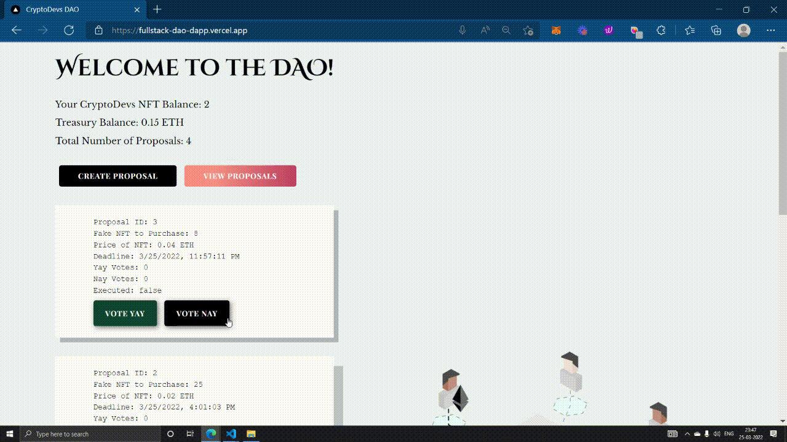
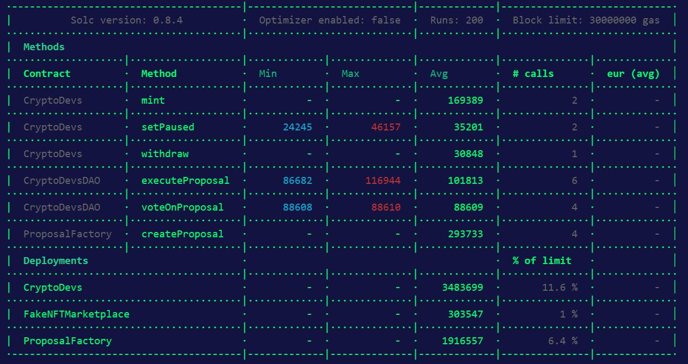
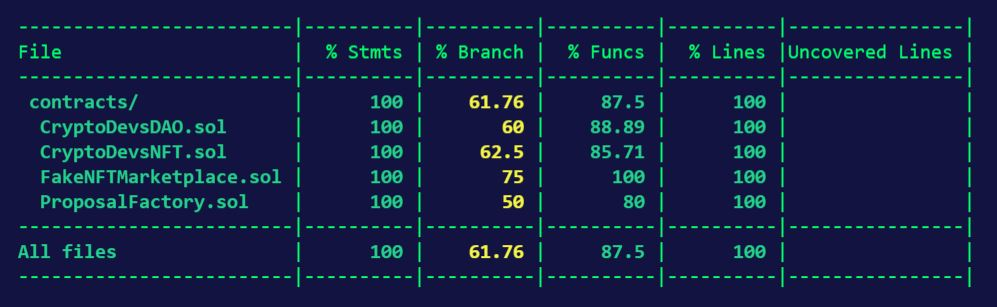

# [Full Stack DAO Dapp](https://fullstack-dao-dapp.vercel.app/) 

## Project is live in the 🔗Rinkeby Test Network🔗
- ### [Check Out 🚀 Live DAO Project ](https://fullstack-dao-dapp.vercel.app/)
- ### [Check Out 🚀 NFT Minting Dapp ](https://nft-collection-dapp-kappa.vercel.app/) ⚠ Mint your NFT to participate in the DAO ⚠
- ### Collect your Rinkeby-Eth from [this faucet](https://faucets.chain.link/rinkeby)

## Project GIF



## Project Description 📃

### [Full Stack DAO Project using OpenZeppelin's Minimal Proxy](https://fullstack-dao-dapp.vercel.app/)
- Users need to mint the NFT from this [NFT Minting Dapp.](https://nft-collection-dapp-kappa.vercel.app/)
- Only Crypto Dev NFT Holders will be able to create proposals and vote.
- Proposals are created using [EIP 1167 minimal proxies.](https://eips.ethereum.org/EIPS/eip-1167)
- NFT Holders can create proposals by specifying the parameters required to make a purchase from the NFT Marketplace.
- On creation of a proposal, proposal factory contract sends Ether to the newly created proposal contract.
- `10 minutes` is the voting period for the proposal. Only the NFT Holders are allowed to vote.
- After the voting period, the proposal can be executed by the Crypto Dev NFT Holders.
- If `YayVotes > NayVotes`, then proposal is executed ⏩ NFT is purchased from the NFT Marketplace using the Ether in the proposal contract.
- If `YayVotes < NayVotes`, then proposal is not executed ⏩ Ether in the proposal contract is sent to the proposal factory contract.

## Directory Structure 📂
- `my-app` ⏩ Contains the Next.js Frontend of this application
- `DAO-Contract/contracts` ⏩ Contains all the Solditiy smart contracts deployed in the Rinkeby Test Network.
- `DAO-Contract/test` ⏩ Contains Tests for the smart contract

## Run This Project 🏃‍♀️💨
1. Clone this repository 
```shell 
git clone https://github.com/ShivaShanmuganathan/fullstack-dao-dapp
```

2. Frontend - goto the frontend folder, install dependencies, and run the app. Visit [localhost:3000](http://localhost:3000/)
```shell
cd my-app
npm install
npm run dev
```
3. Backend - goto to the backend folder, install dependencies, compile and test the smart contract
```shell
cd DAO-Contract
npm install
npx hardhat compile
npx hardhat test
```

### Environment variables (not needed for running project locally) l
Create a `.env` file in the DAO-Contract folder and fill it up with the below instructions
``` shell
// Go to https://www.alchemyapi.io, sign up, create
// a new App in its dashboard and select the network as Rinkeby, and replace "add-the-alchemy-key-url-here" with its key url
ALCHEMY_API_KEY_URL="YOUR-RINKEBY-ALCHEMY-KEY"

// Replace this private key with your RINKEBY account private key
// To export your private key from Metamask, open Metamask and
// go to Account Details > Export Private Key
// Be aware of NEVER putting real Ether into testing accounts
RINKEBY_PRIVATE_KEY="YOUR-PRIVATE-KEY"
```
## Gas Report ⛽



## Test Coverage Report 🛸



